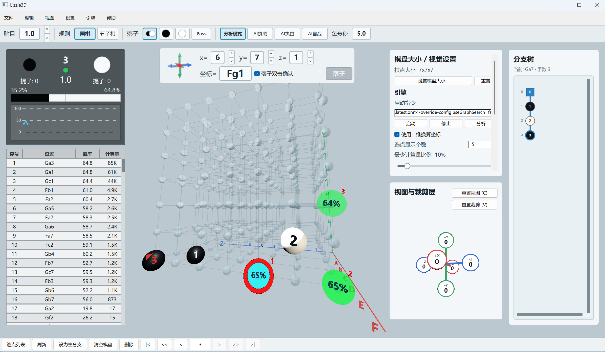

# Lizzie3D

[English](README.md)

Lizzie3D 是一个早期阶段的 Qt 6 桌面程序，用来做 3D 围棋 / 3D 五子棋界面。它目前重点放在可操作的 3D 棋盘、Lizzie 风格复盘控件、SGF 读写、规则感知落子，以及实验性的外部 AI 引擎分析和对弈。

项目还不完善。引擎接入、界面细节、SGF 兼容性和分析流程都还在快速变化。



## 功能

- 使用 Qt Quick 3D 渲染 3D 棋盘。
- 棋盘长宽高可分别设置，范围为 1x1x1 到 19x19x19。
- 透视相机，支持键盘和鼠标移动、旋转、缩放。
- `W/A/S/D` 和 `Q/E` 按当前相机朝向移动。
- 支持从六个方向裁剪棋盘层数，并通过可旋转的“视图与裁剪层”控件操作。
- 裁剪六轴的小球可以点击对齐镜头方向。
- 使用类似 `Aa1` 的三维坐标标签。
- 坐标输入栏使用 1 起始的 `x/y/z` 数字，并带上下调节按钮。
- 支持双击确认落子；非法选点会显示为红色，落子按钮会禁用。
- 支持落子、pass、删除节点、回溯、分支切换、设为主分支和清空棋盘。
- 右侧 Lizzie 风格棋谱分支树，支持横向和纵向滚动。
- 左侧 Lizzie 风格分析面板，包含提子数、引擎状态、胜率条、胜率曲线和选点列表。
- 支持读取和保存当前棋谱树为 SGF，包括 `SZ[x:y:z]` 棋盘尺寸。
- 支持中文和英文界面，默认中文。
- 针对较大棋盘做了渲染优化，包括线网格和数学射线选点。

## 规则

Lizzie3D 目前支持两种规则：

- **3D 围棋**：按六邻接方向计算气并提子。没有气的禁入点和简单打劫禁着点会显示为红色，不能落子。
- **3D 五子棋**：检测 3D 方向上的连五，并用红色柱子标出。

切换规则会清空棋盘。如果当前棋谱有未保存修改，程序会先询问是否保存 SGF。

## 引擎分析

Lizzie3D 已经加入实验性的 GTP 风格引擎接入。它可以启动外部引擎、同步当前局面、请求 `kata-analyze 50`，并显示带胜率标签的引擎选点。左侧面板会列出引擎选点，并沿当前棋谱路径记录胜率曲线。

程序也加入了早期对弈模式：分析模式、AI 执黑、AI 执白和 AI 自战。AI 对弈使用 GTP 的 `time_settings` 和 `genmove`；`genmove` 返回后，Lizzie3D 认为引擎内部已经自动落了这一手，并用增量方式保持引擎棋盘同步。如果在 `genmove` 思考途中修改棋盘，下一次引擎请求前会先 `clear_board` 并从当前棋谱路径完整重放。

对于目前把 3D 棋盘展开成 2D 坐标协议的引擎，Lizzie3D 支持二维换算坐标。原生 3D 命令名也已经预留，方便以后接入真正的 3D 协议。

这一部分仍然比较粗糙，目前默认依赖本机配置的引擎启动命令。

引擎通信窗口可以从菜单或按 `U` 打开，用不同颜色显示 stdin/stdout/stderr，也可以手动发送命令。

## 构建

环境要求：

- Windows。
- CMake 3.24 或更新版本。
- Visual Studio 2022，包含 C++ 桌面开发工具链。
- Qt 6.8 或更新版本，需要 Qt Quick 和 Qt Quick 3D。

当前脚本默认 Qt 安装在：

```powershell
.tools\Qt\6.10.3\msvc2022_64
```

使用项目自带脚本：

```powershell
powershell -NoProfile -ExecutionPolicy Bypass -File .\scripts\build.ps1
```

运行程序：

```powershell
powershell -NoProfile -ExecutionPolicy Bypass -File .\scripts\run.ps1
```

手动构建示例：

```powershell
cmake -S . -B build\lizzie3d -G "Visual Studio 17 2022" -A x64 -DCMAKE_PREFIX_PATH="C:\Qt\6.10.3\msvc2022_64"
cmake --build build\lizzie3d --config Release
```

如果要生成可分发目录，可以对生成的 exe 运行 `windeployqt`：

```powershell
C:\Qt\6.10.3\msvc2022_64\bin\windeployqt.exe --qmldir qml build\lizzie3d\Release\lizzie3d.exe
```

## 操作

- `W/S`：沿当前视角上下移动相机目标点。
- `A/D`：沿当前视角左右移动相机目标点。
- `Q/E`：沿当前视角前后移动。
- `X/Z`：减少/增加当前面向方向的裁剪层数。
- 左/右方向键：水平旋转镜头。
- `Space`：暂停/继续引擎分析；对局中停止 AI 对局并回到分析模式。
- `,`：按引擎第一选点落一手。
- `P`：pass。
- `U`：打开引擎通信窗口。
- `Ctrl+O`：打开 SGF 文件。
- `Ctrl+S`：保存当前棋谱树为 SGF。
- `Ctrl+I`：设置棋盘长宽高。
- `Backspace`：删除当前节点。
- `M`：切换棋子手数显示模式。
- 在棋盘或“视图与裁剪层”面板内左键拖拽：旋转相机。
- 在棋盘上右键或中键拖拽：平移相机目标点。
- 在棋盘上滚轮：缩放。
- 在裁剪六轴圆圈上滚轮：调整对应方向裁剪层数。

## 目录结构

```text
.
+-- CMakeLists.txt
+-- qml/
|   +-- Main.qml
|   +-- BoardScene.qml
|   +-- BoardInputLayer.qml
|   +-- BranchPanel.qml
|   +-- ClipPanel.qml
|   +-- AnalysisToolbar.qml
|   +-- CoordinateInputPanel.qml
|   +-- ...
+-- scripts/
|   +-- build.ps1
|   +-- run.ps1
+-- src/
    +-- main.cpp
    +-- fileio.cpp
    +-- enginecontroller.cpp
```

## 许可证

Lizzie3D 使用 GNU General Public License version 3 only（`GPL-3.0-only`）发布。详见 [LICENSE](LICENSE)。
