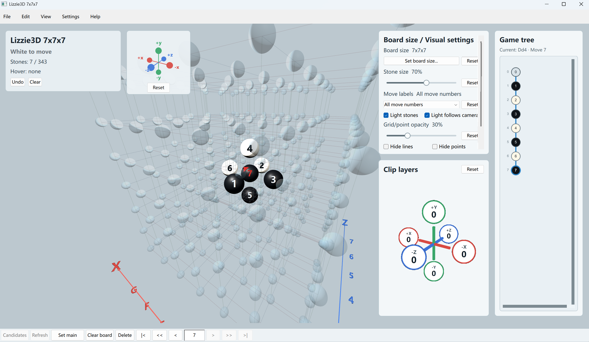

# Lizzie3D

Lizzie3D 是一个实验中的 Qt 6 桌面端 3D 五子棋分析界面。它目前重点放在清晰可操作的 3D 棋盘、棋谱分支树、裁剪工具，以及未来接入外部 AI 引擎的界面基础上。

项目还处在早期阶段。当前已经可以在 3D 棋盘上落子、编辑分支、保存基础 SGF，但还没有接入 AI 引擎，也没有实现胜负判定。

[English](README.md)



## 功能

- 使用 Qt Quick 3D 渲染 3D 棋盘。
- 棋盘长宽高可分别设置，范围为 1x1x1 到 19x19x19。
- 透视相机，支持键盘和鼠标移动、旋转、缩放。
- `W/A/S/D` 和 `Q/E` 按当前相机朝向移动。
- 支持从六个方向裁剪棋盘层数，可通过可旋转的六轴裁剪控件和快捷键操作。
- 六轴视角控件，可点击对齐相机方向；在任意六轴面板内左键拖拽也可以旋转相机。
- 使用类似 `Aa1` 的三维坐标标签。
- 支持落子、删除节点、回溯、分支切换和设为主分支。
- 右侧 Lizzie 风格棋谱分支树。
- 支持读取和保存当前棋谱树为 SGF，包括 `SZ[x:y:z]` 棋盘尺寸。
- 支持棋子手数显示模式切换。
- 支持中文和英文界面，默认中文。
- 针对较大棋盘做了渲染优化，包括线框 mesh 和数学射线选点。

## 当前状态

已经实现：

- 3D 棋盘交互。
- 本地棋谱树编辑。
- 基础 SGF 读取和保存。
- 中英文界面文本。
- 棋子、网格、裁剪、灯光、手数显示等视觉设置。

尚未实现：

- AI 引擎协议接入。
- AI 推荐选点显示。
- 规则判断和胜负判定。
- 与外部工具的完整 SGF 兼容性测试。

## 环境要求

- Windows。
- CMake 3.24 或更新版本。
- Visual Studio 2022，包含 C++ 桌面开发工具链。
- Qt 6.8 或更新版本，需要 Qt Quick 和 Qt Quick 3D。

当前脚本默认 Qt 安装在：

```powershell
.tools\Qt\6.10.3\msvc2022_64
```

如果你的 Qt 在其他位置，可以修改 `scripts/build.ps1` 里的 `$QtDir`，或者使用下面的手动 CMake 命令。

## 构建

使用项目自带脚本：

```powershell
powershell -NoProfile -ExecutionPolicy Bypass -File .\scripts\build.ps1
```

运行程序：

```powershell
powershell -NoProfile -ExecutionPolicy Bypass -File .\scripts\run.ps1
```

手动构建示例：

```powershell
cmake -S . -B build\lizzie3d -G "Visual Studio 17 2022" -A x64 -DCMAKE_PREFIX_PATH="C:\Qt\6.10.3\msvc2022_64"
cmake --build build\lizzie3d --config Release
```

如果要生成可分发目录，可以对生成的 exe 运行 `windeployqt`：

```powershell
C:\Qt\6.10.3\msvc2022_64\bin\windeployqt.exe --qmldir qml build\lizzie3d\Release\lizzie3d.exe
```

## 操作

- `W/S`：沿当前视角上下移动相机目标点。
- `A/D`：沿当前视角左右移动相机目标点。
- `Q/E`：沿当前视角前后移动。
- `X/Z`：减少/增加当前面向方向的裁剪层数。
- 左/右方向键：水平旋转镜头。
- `Space`：重置镜头。
- `Ctrl+O`：打开 SGF 文件。
- `Ctrl+S`：保存当前棋谱树为 SGF。
- `Ctrl+I`：设置棋盘长宽高。
- `Backspace`：删除当前节点。
- `M`：切换棋子手数显示模式。
- 在棋盘或任意六轴面板内左键拖拽：旋转相机。
- 在棋盘上右键或中键拖拽：平移相机目标点。
- 在棋盘上滚轮：缩放。
- 在裁剪六轴圆圈上滚轮：调整该方向裁剪层数。

## 目录结构

```text
.
+-- CMakeLists.txt
+-- qml/
|   +-- Main.qml
|   +-- BoardScene.qml
|   +-- BoardInputLayer.qml
|   +-- BranchPanel.qml
|   +-- ClipPanel.qml
|   +-- ...
+-- scripts/
|   +-- build.ps1
|   +-- run.ps1
+-- src/
    +-- main.cpp
    +-- fileio.cpp
    +-- fileio.h
```

## 备注

本地工具链、构建输出、日志和部署后的二进制文件都已经加入 `.gitignore`。仓库只应该包含源代码和项目文件。

## 许可证

Lizzie3D 使用 GNU General Public License version 3 only（`GPL-3.0-only`）发布。详见 [LICENSE](LICENSE)。
